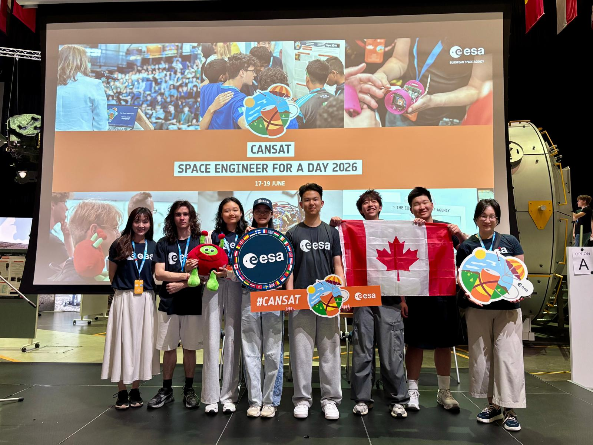
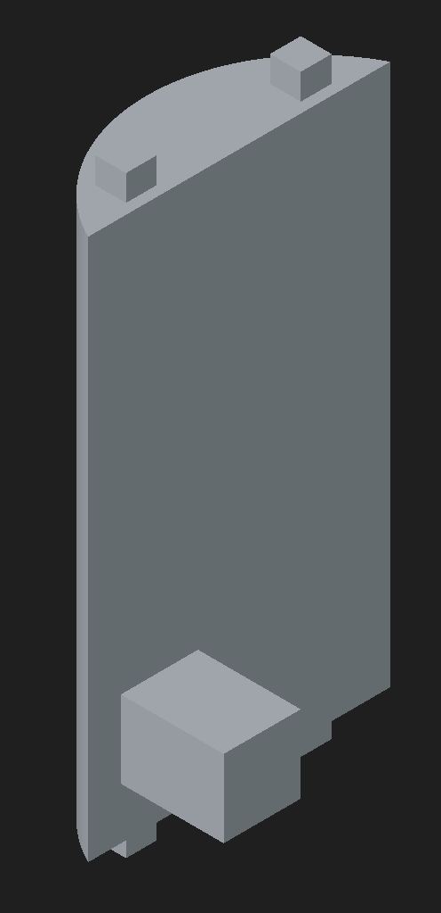
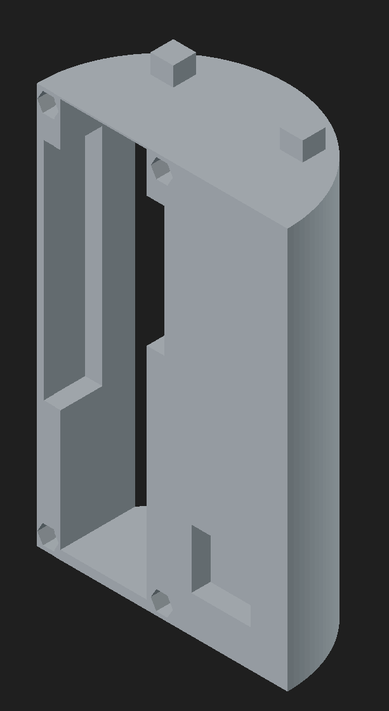

# CanSat Competition 2026 Team YannyOrLora | 1st in Canada and represented Canada in Eurpean Space Agency

## Team Members

- [Matthew Song](#) - Co Captain
    - Paracute Design
    - Developing and testing landing gears
- [Asa Liu](#) - Co Captain
    - Frame Design
    - Mechanical Design
    - Electrical Design
- [Zoey Cheang](https://www.linkedin.com/in/zoey-cheang-855535368/) - Firmware lead
    - Website Development
    - CanSat Firmware
    - Radio Communication
- [Naiming Zheng](https://www.linkedin.com/in/naiming-z-1a4383371/) - Software Lead
    - Ground Station Software
    - Three-Ways-Communication Development
- [Bogdan Shkromiuk](https://www.linkedin.com/in/bogdan-shkromiuk-215a08417/) - Hardware Lead
    - Hardware Design
    - CanSat and Radio Device Asesembly
    - Frame Design
- [Dora Yuen](https://www.linkedin.com/in/dora-yuan-2a594b307/) - Outreach Lead
    - Organise Outreach Event
    - Design Landing Gear
    - Report Main Author

## Project Abstract

CanSat competition challenges teams to design and build a soda-can-sized satellite, launch it to around 1km altitude, and safely recover telemetry every seconds as it descends. Our mission extends the standard telemetry, allowing the CanSat also acts as a relay for a wearable hiker SOS device, listening for signals on a separate radio channel and forwarding the hiker's vitals, GPS position, and environmental readings back to the ground station alongside the CanSat's own sensor data, while acknowledging receipt back to the hiker device so it knows help is aware of its location.

## This Repository

The project is split into the following directories:
 
- [`docs/`](docs/) — our competition website, published live via GitHub Pages at **[https://cowhair.github.io/YannyOrLora]**
- [`firmware/`](firmware/) — Arduino code for all three onboard systems: the CanSat, the ground station, and the SOS device
- [`cad/`](cad/) — 3D models and mechanical design files for the CanSat body and SOS device enclosure
- [`data/`](data/) — telemetry collected during test flights and the competition run
- [`presentations/`](presentations/) — slide decks and reports used during design reviews and the competition

## Mission Overview

The CanSat is launched to around 1km altitude and descends under parachute, while continuously transmitting telemetry including: (temperature, humidity, pressure, altitude, GPS position) to the ground station once per second. Independently, a wearable SOS device carried to simulate a hiker in emerency situation broadcasts a SOS packet with (heart rate, GPS position, local temperature/humidity) whenever button on the device is triggered.

The CanSat acts as the relay between the emerency device and ground station. It listens for the SOS device's signal, caches the most recent emerency data it hears, and piggybacks those fields onto its normal telemetry stream to the ground. The ground station sees both the CanSat's own descent data and the hiker's status in a single feed, without needing separate ground hardware for each link.

## Radio System (Time Sliced Relay Architecture)

The onboard radio logic (LoRa, via RadioLib) runs on a strict 1 second frame, split into three phases:

| Phase | Window | Action |
|---|---|---|
| Listen | 0–850 ms | Radio tuned to the SOS device's sync word; any emerency packet received is parsed and cached |
| Transmit | 850 ms–~950 ms | Telemetry is sent to the ground station and an ACK is sent back to the SOS device if time remains in the frame |
| Pad | remainder | GPS and LED housekeeping, holding the frame to exactly 1 second |

Two separate LoRa sync words keep the two links from colliding on the same channel: one for the CanSat↔SOS-device link, one for the CanSat→ground link. Cached SOS data expires automatically if no new packet arrives within 10 seconds, so the ground station is never shown stale distress information. ACKs to the SOS device are rate-limited so the CanSat doesn't spend its listen/transmit budget re-acknowledging every frame once contact is established.

## Hardware/Mechanical Design
<table>
    <tr>
        <td></td>
        <td></td>
    </tr>
</table>

## Firmware

## Software

